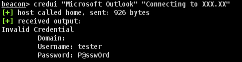

# BOF - Credentials Collection via CredUIPromptForWindowsCredentials

 Invokes Windows credential prompt using Windows API `CredUIPromptForWindowsCredentials` and verify the credential with `LogonUser` subsequently.




----


### Usage

```
credui "Caption" "Message"
```


### Compile

```
cl.exe /c /GS- credui.c /Focredui.x86.o
```


### References

+ [Credentials Collection via CredUIPromptForCredentials](https://www.ired.team/offensive-security/credential-access-and-credential-dumping/credentials-collection-via-creduipromptforcredentials) from ired